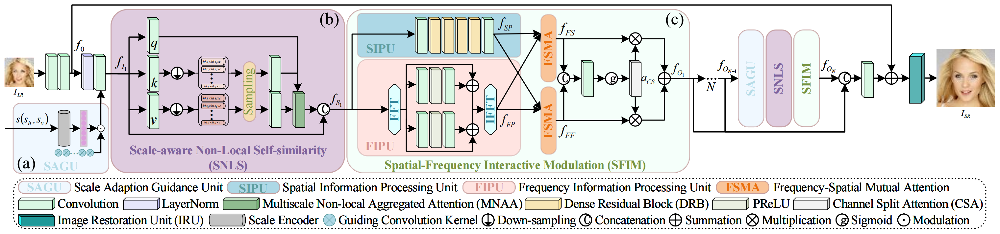
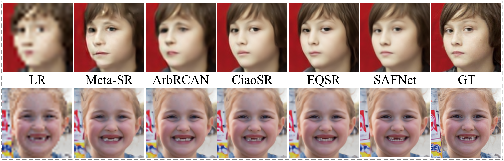
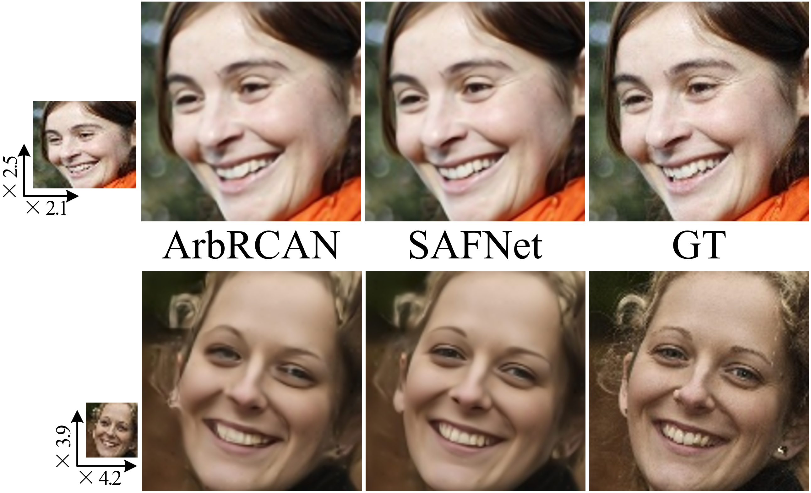

# See as You Desire: Scale-adaptive Face Super-Resolution for Varying Low Resolutions 

The source code is coming soon……

## Comparison results for ×4 and ×8 FSR tasks on the CelebA/Helen/FFHQ testing set. 

## Comparison results for arbitrary-scale FSR tasks on the CelebA/Helen/FFHQ testing set. 

